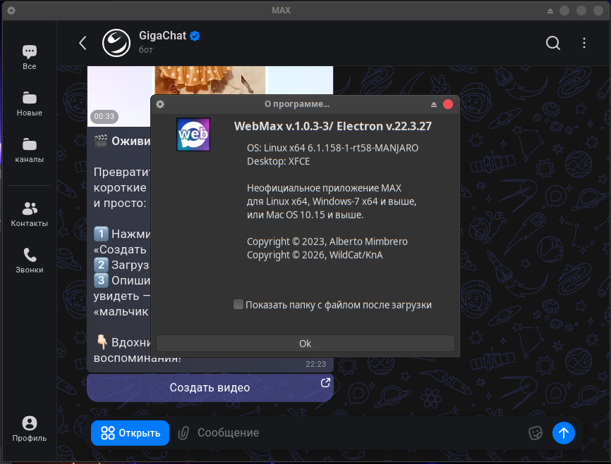
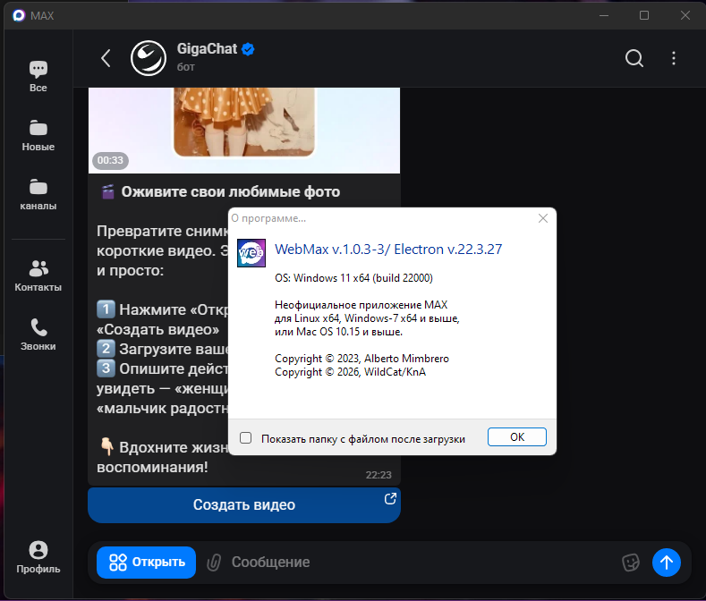
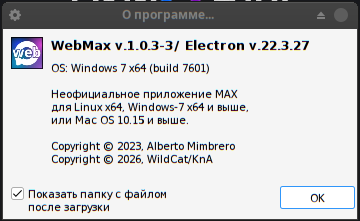
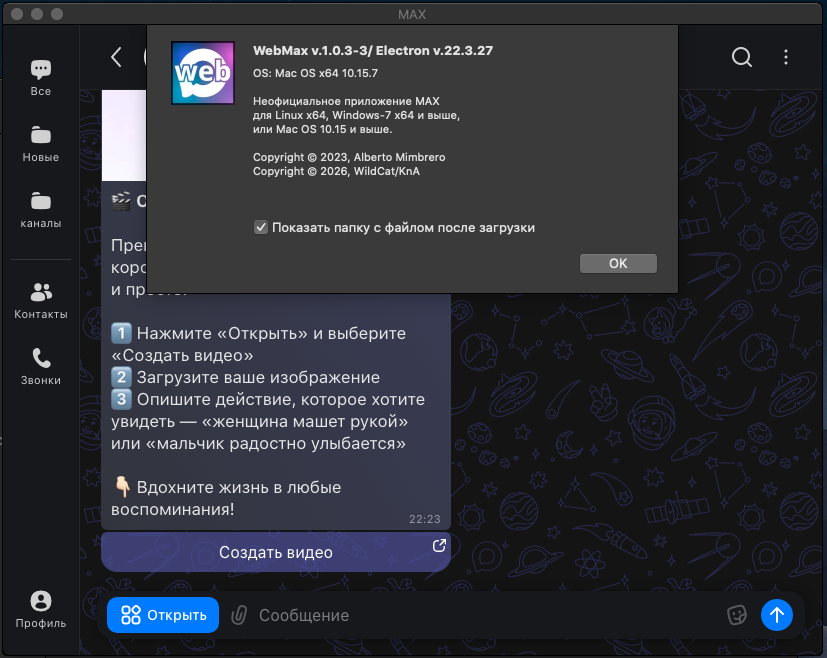

# MAX Desktop for Linux / Windows-7 / MacOS-10.15 (unofficial)
MAX Linux client built with Electron (used Electron-v22.3.27). Here is an unofficial build (because as an official MAX it is written poorly).
It is fork from [WhatsApp-Desktop-Linux](https://github.com/mimbrero/whatsapp-desktop-linux) that's written by Alberto Mimbrero.

This app can be used on any Linux-x64, Windows-7_x64 or higther and MacOS-10.15.x or highter.
##

## 📜 Disclaimer
This just loads https://web.max.ru/ with some extra features, but never changing the content of the official webpage (html, css nor javascript). 

This wrapper is not verified by, affiliated with, or supported by MAX Inc.
##

## 💾 Installation

### - Linux


Use AppImage or Snap package.

### - Windows
 

Just unpack ZIP in any folder and enjoy.

### - MacOS


Move .App from DMG (or unpack ZIP) to /Applications.
##

## :construction: Development
PR and forks are welcome!

1. Clone the repo
```bash
git clone https://github.com/WildCatKnA/webmax-linux.git
cd webmax-linux
```

2. Install dependencies
```bash
npm install
```

3. Run or build
```bash
npm run start  # compile and run
npm run build  # compile and build
```

4. Also you may use commands (for example if using cross build on your host)
```bash
npm run linux    # compile and build for Linux
npm run windows  # compile and build for Windows
npm run mac      # compile and build for MacOS
```

5. Have fun =)
