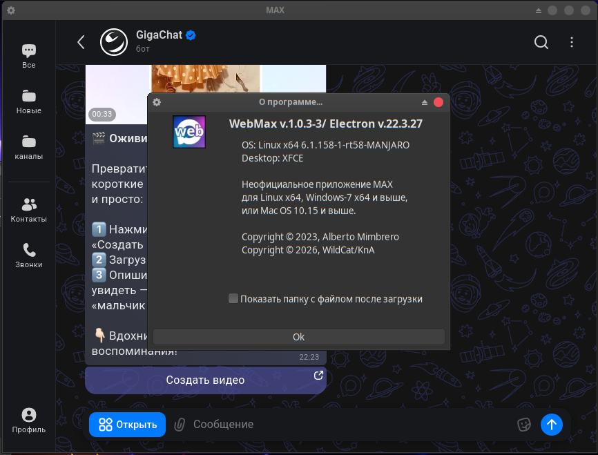
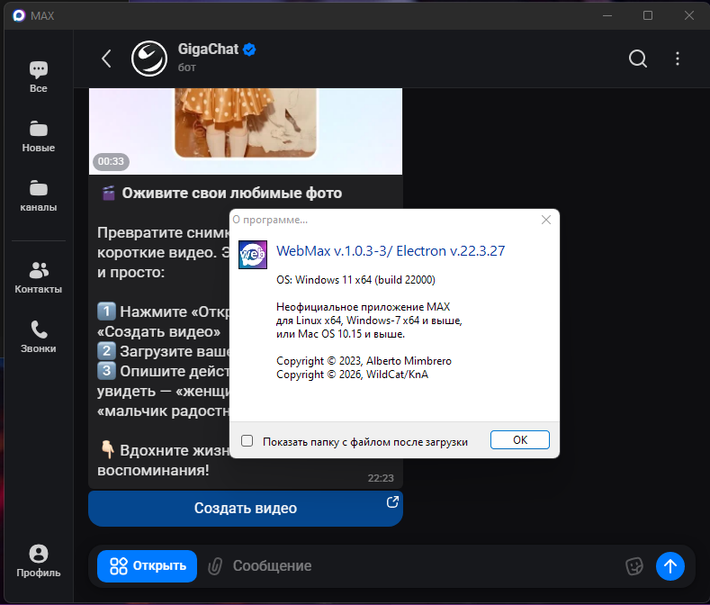
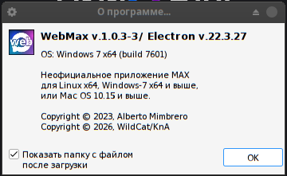
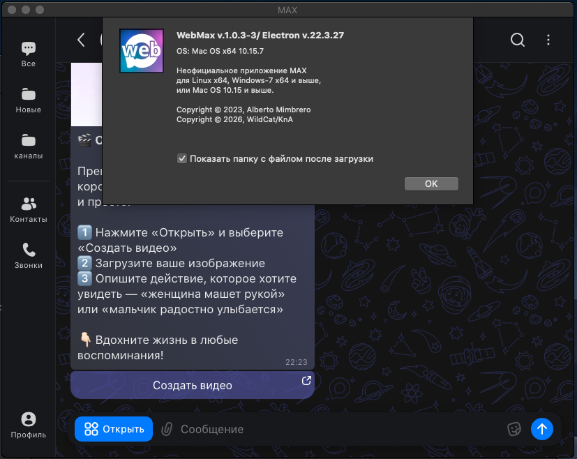

# MAX Desktop for Linux / Windows-7 / MacOS-10.15 (unofficial).
MAX Linux client built with Electron (used Electron-v22.3.27). Here is an unofficial build (because as an official MAX it is written poorly).
It is fork from [WhatsApp-Desktop-Linux](https://github.com/mimbrero/whatsapp-desktop-linux) that's written by Alberto Mimbrero.

This app can be used on any Linux (x64), Windows-7 (x86 & x64) or higther and MacOS-10.15.7 or highter (x64).
Also here you can find build for MacOS-12.x (arm64 but only in .zip).
##

## 📜 Disclaimer
This just loads https://web.max.ru/ with some extra features, but never changing the content of the official webpage (html, css nor javascript). 

This wrapper is not verified by, affiliated with, or supported by MAX Inc.
##

## 💾 Installation

### - Linux


Use AppImage or Snap package.

### - Windows
 

Just unpack ZIP in any folder and enjoy.

### - MacOS


Move .App from DMG (or unpack ZIP) to /Applications.
##

## :construction: Development
PR and forks are welcome!

1. Clone the repo
```bash
git clone https://github.com/WildCatKnA/webmax-linux.git
cd webmax-linux
```

2. Install dependencies
```bash
npm install
```

3. Run or build
```bash
npm run start  # compile and run
npm run build  # compile and build
```

4. Also you may use commands (for example if using cross build on your host)
```bash
npm run linux    # compile and build for Linux
npm run windows  # compile and build for Windows
npm run mac      # compile and build for MacOS
```

5. Have fun =)

6. Version history:
### v1.0.1-1
- Initial release.

### v1.0.2-1
- New icons, some changes.
- Added app for MacOS 10.15.7 or highter

### v1.0.3-1
- Now using Electron v.22.3.27;
- Added CheckBox in AboutDialog for block playing videos (needs restart App);
- Some little changes.

### v1.0.3-2
- Added blocking autoplay videos;
- Now can play audiomessages;
- Some little changes.
Please uncheck checkBox in About dialog (because it's block All videos and audios)

### v1.0.3-3
- Repaired broken notifications;
- Now can translate our screen with video calls;
- little fixes.

### v1.0.4-1
- You can now select a window or screen to broadcast in video calls.

### v1.0.4-2
- Now you can use this App as Portable (Windows/Linux) - All data will be saved in the same folder as the application. To make the application portable, create an empty file named is_portable.txt in the application folder.
- Added build for Windows x86.
- Little fixes.

### v1.0.4-4
- Fixed dependency on color scheme at startup or when selecting a window to broadcast.

### v1.0.4-8
- Now, if you have an image in the clipboard, you can paste it into the message line not only with Ctrl+V, but also via the "Paste" context menu option (this may not work in rare cases).
- Windows: The number of unread chats is now displayed not only in the system tray, but also on the application icon on the taskbar (provided the taskbar is not small). (on Linux number of unreads displayed on tray, on Mac it doesn't work)
- Minor code fixes to address some bugs, optimize, and reduce weight.
- Now you can start this app as hidden in Tray by launch with parameter --hidden
```bash
/path/to/your/webmax/webmax --hidden
```
- Mac-builds supports MacOS 10.15.7 and higher but "Paste" from context menu doesn't work (use Command+V keys)
- If you need a portable version, create an empty file is_portable.txt in the application folder.
- Also added builds on electron-40 for Windows 10 and higher (x86/x64) and Linux (x64)

### v1.0.4-9
- When saving a file, a dialog box for selecting a folder to save the file to is always (I hope) displayed (to avoid the annoying task of opening the file's folder after saving, uncheck "Show directory..." in the "About" window).
- After saving an application, the application remembers all used labels, even if you restart the application.
- A "Spell Check" option has been added to the tray menu (spell checking is disabled by default; click the menu, and it will tell you whether to enable or disable it. 
- for Win7 and MacOS used Electron-22, and for Win10 and Linux used Electron-40.
